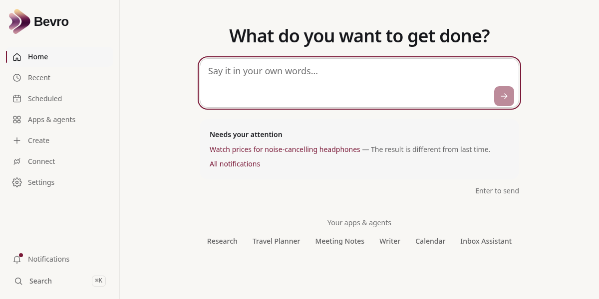
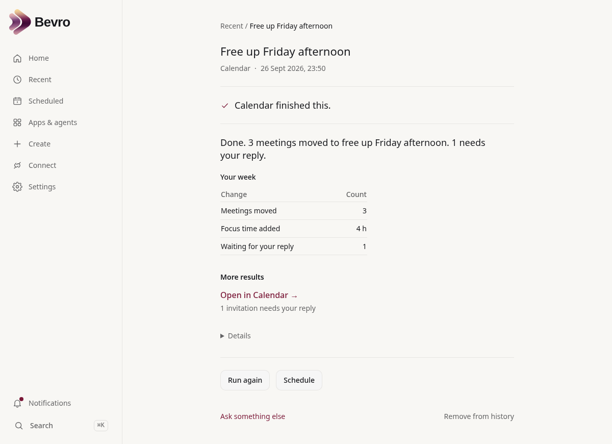
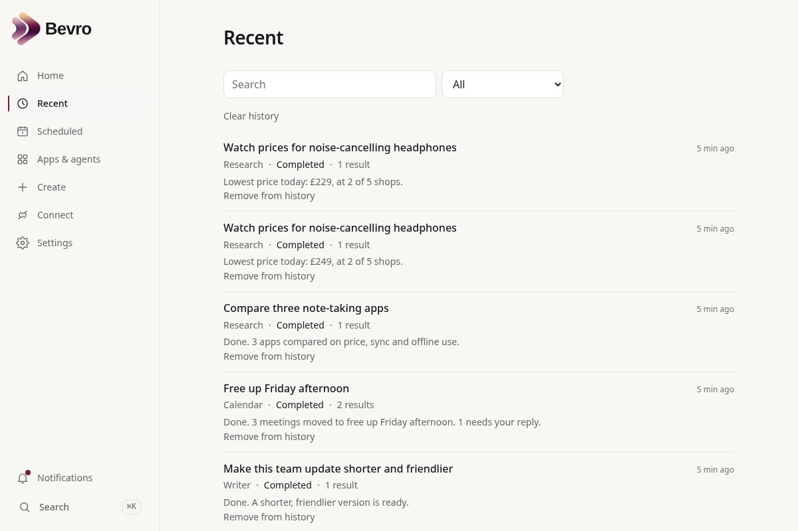
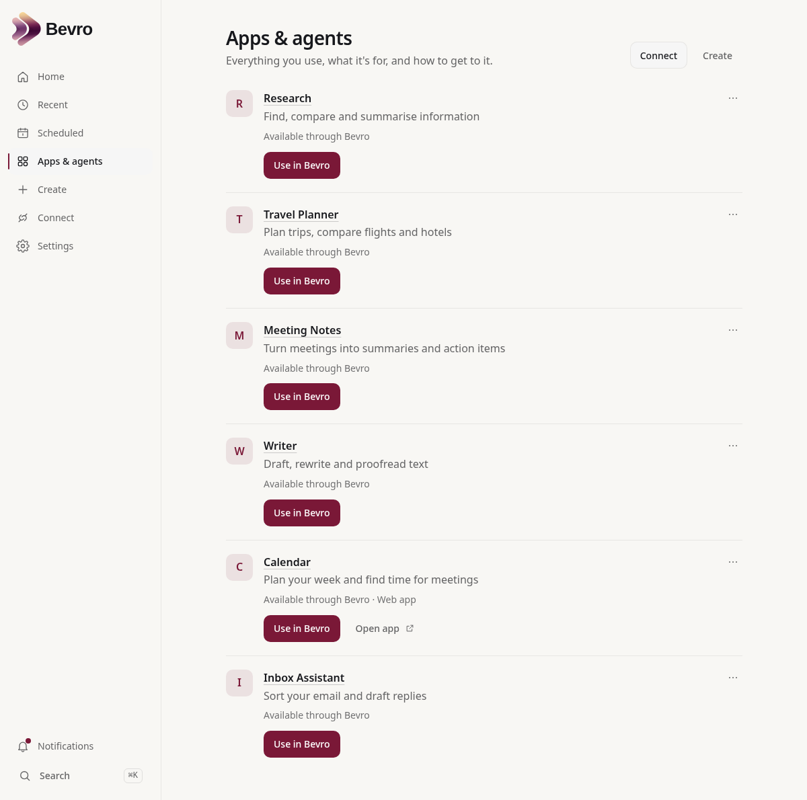
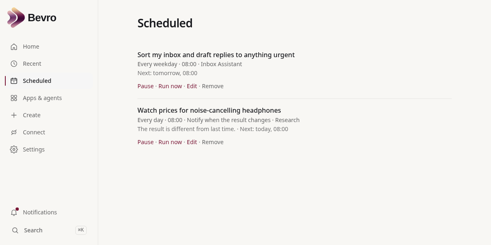
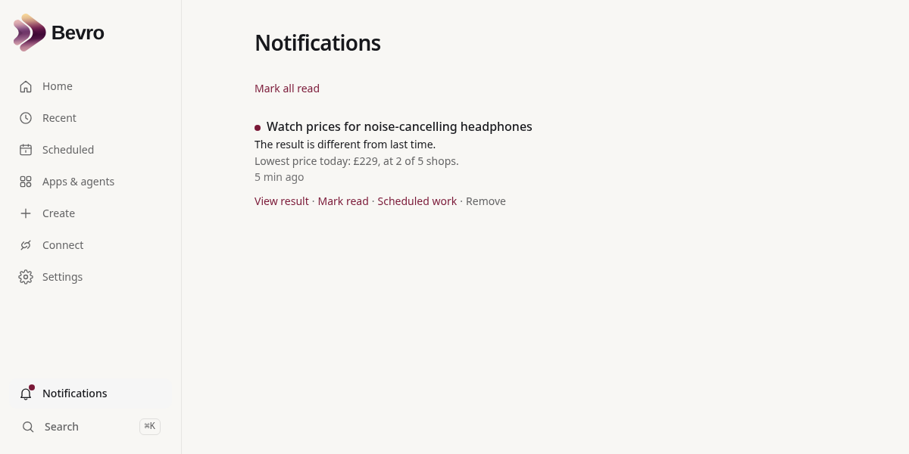
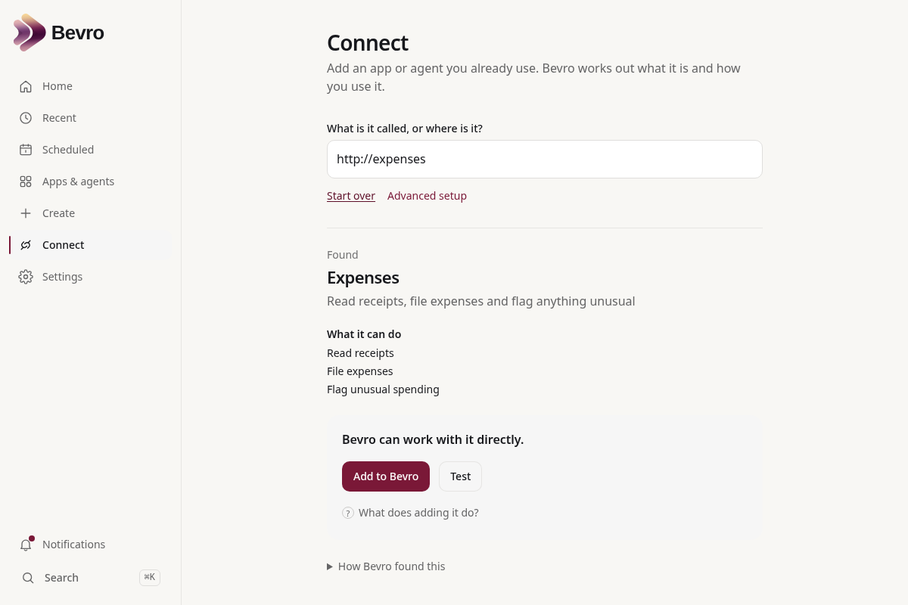
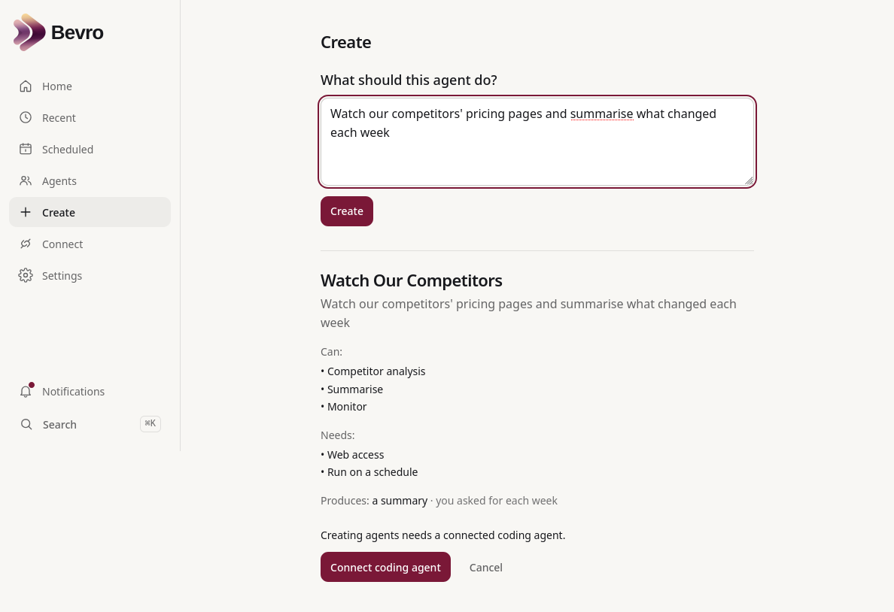
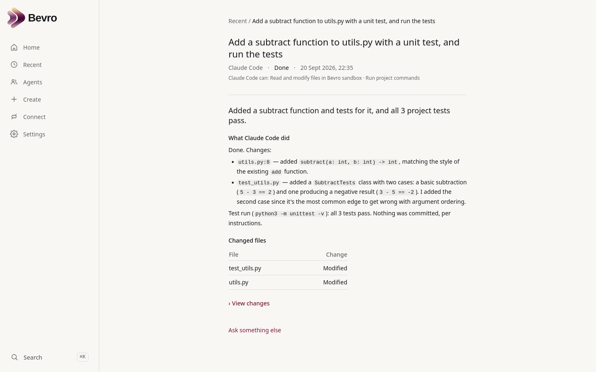
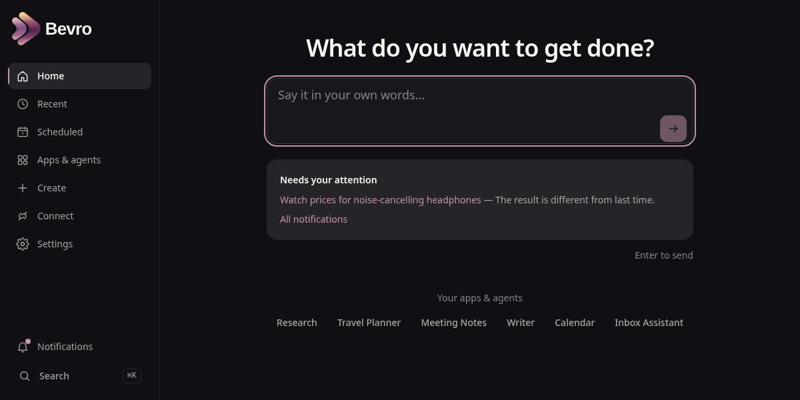

<p align="center">
  
  
</p>

<p align="center">
  <a href="LICENSE"></a>
  
  
</p>

# Bevro

**One place for all your AI agents and apps — on your own machine.**

Bevro is a self-hosted hub. Connect the agents and apps you already use, then
ask for what you need in plain words. Bevro picks the right one, hands the
work over and keeps the result — in a database on your own hardware.

## The problem

- **Agents are scattered.** A research agent here, a coding agent there, a
  script in a folder, a web app in a browser tab. Each has its own screen, its
  own history and its own place where results end up. Few tools bring them
  together.
- **The platforms that do bring them together keep your data.** Hosted
  assistants such as ChatGPT or Claude can connect to tools and agents, but
  then your requests, results and connected accounts live on their servers,
  under their terms.
- **Agent frameworks help you build one agent,** not live with twenty. They
  do not help you find the right one, run it, repeat it and keep track of
  what it did.

## What Bevro does

| | |
|---|---|
| **Brings them together** | Type a web address, a folder, a command or an MCP server (a common way for AI tools to offer their functions to other programs). Bevro works out what it is and connects it, without changing it. Apps it cannot drive are listed too, with a link to open them. |
| **Finds the right one** | Ask in plain words. Bevro chooses by what each agent says it can do — or tells you which app to open. |
| **Keeps one record** | Every request becomes a task with an honest status, a short outcome and the files behind it, whichever agent did the work. |
| **Repeats and watches** | "Every Monday…" or "check daily, tell me only when something changes" — without touching the agent. |
| **Stays yours** | Runs with Docker on your computer or server. Tasks, results and credentials sit in your own PostgreSQL database. By default Bevro itself sends nothing to any outside service. |

```
You:        "Free up Friday afternoon"
                     ↓
Bevro:      creates a Task, picks the calendar agent, watches it work
                     ↓
Provider:   the calendar assistant you already use
                     ↓
Result:     "Done. 3 meetings moved. 1 needs your reply."   Open in Calendar →
```

### What "stays yours" does and does not mean

- **Bevro's own record** — every request, result, schedule and stored key —
  never leaves your machine.
- **A connected agent behaves as it always did.** If it is a cloud service,
  your request still goes to that service. Bevro changes where the record of
  your work lives, not where each agent sends its data.
- **The optional routing model** (see [Routing](#routing)) sends the text of
  each request to the model service you choose — or to one you host yourself.
- **There is no login yet.** Bevro listens only on the machine it runs on. On
  a shared server, put it behind something that asks for a password first;
  see [SECURITY.md](SECURITY.md).

### What Bevro is not

- **Not an agent framework.** It runs no agent loops, chooses no models and
  holds no prompts. It sits above the things that do the work.
- **Not a new protocol.** Agents and apps do not have to change to be used;
  Bevro adapts to them.
- **Not a sandbox.** Local agents run as you, in folders you approve.

## Screenshots

| Home | A result |
|---|---|
|  |  |

| Recent | Apps & agents |
|---|---|
|  |  |

| Scheduled work | Notifications |
|---|---|
|  |  |

| Connect found an agent | Create previews one |
|---|---|
|  |  |

A coding agent, working in a directory you approved (optional — see
[installation mode C](#three-ways-to-run-it)):



<p align="center"></p>

<sub>The screenshots show a workspace with a few stand-in agents connected
(inbox, writing, meeting notes, research, travel, calendar), returning sample
results so there is something to look at. A new installation starts empty.</sub>

## Core concepts

| | |
|---|---|
| **Provider** | Anything capable of doing work: an AI agent, a SaaS app, a workflow, a local service, a coding tool, a person. There is no provider *type*; a provider declares **capabilities**. |
| **Runtime** | How *this installation* reaches that provider: a running API, a command in a folder, an MCP server, a Compose service. A provider may have several; Bevro picks one and falls back when it is down. |
| **Task** | Bevro's own record of a request: what was asked, where it has got to, the concise outcome. Tasks belong to Bevro, never to a provider. |
| **Artifact** | What came back: a note, a report, a file, a table, a diff, or a deep link into the provider's own interface. |
| **Automation** | Work Bevro repeats — "every Monday morning", and, for monitoring, "only tell me when something changes". |
| **Notification** | Something worth telling you about, kept separate from the work that produced it. |

## Quick start

You need Docker with Compose v2. Nothing else.

```sh
git clone https://github.com/jc-universe87/bevro.git
cd bevro
docker compose up -d --build
```

Open <http://localhost:6140>. That gives you the web app, the API (Swagger at
<http://localhost:6141/docs>), PostgreSQL and the scheduler.

**It starts empty, on purpose.** The agents in your workspace should be the
ones you chose, so Bevro ships with none of its own:

```
start empty  →  Connect something you already run, or Create an agent  →  ask Bevro
```

Home says so plainly until there is something that can take work, and asking
for something with nothing connected gets an honest answer rather than a demo.

No configuration is needed. To change ports or set your own encryption key,
copy `.env.example` to `.env`. To look around with example agents first, set
`BEVRO_DEMO_MODE=true` — see [Trying it out](#trying-it-out).

### Three ways to run it

Everything beyond the first is optional, and Bevro says plainly when something
is not set up rather than failing.

| | What you get | What it needs |
|---|---|---|
| **A. Core** | The workspace, built-in providers, Connect over HTTP and MCP, scheduling, monitoring, in-app notifications | `docker compose up -d --build` |
| **B. Core + intelligent routing** | A small model chooses which agent takes each request, by declared capability | A, plus `BEVRO_ROUTER_MODE=llm` and an API key in `.env` |
| **C. Core + local and coding agents** | Connect projects on this machine, Claude Code, Create, bridges | A, plus a virtualenv and `./scripts/worker.sh` on the host |

For **C**, the worker runs outside Docker because that is where your project
directories and logged-in CLI tools are:

```sh
python3 -m venv .venv && .venv/bin/pip install -r api/requirements.txt
cp config/workspaces.example.json config/workspaces.json   # where coding agents may work
./scripts/worker.sh                                        # Ctrl-C stops it
```

Optional email or webhook delivery is a few more lines in `.env` — see
[docs/NOTIFICATIONS.md](docs/NOTIFICATIONS.md).

## Connect an existing agent

Under **Connect**, type one thing:

```
~/agents/market-research          a local project
http://localhost:8000             a service with an OpenAPI description
http://localhost:3333/mcp         an MCP server
python -m my_agent                a command
```

Bevro looks (never touches), shows what it found — name, description,
capabilities, how it will be reached — asks for a key only if one is needed,
and connects. It appears under **Apps & agents** and, when Bevro can send it
work, is routable at once.
Local projects and commands are inspected and run by the host worker, which
asks you once - in the browser, about that one folder or program - and
remembers the answer under **Settings → Access & trust**, where you can take
it back. Nothing is configured in advance, and the project itself is left
byte-for-byte as it was. **Advanced setup** is the escape hatch
for anything discovery cannot work out. See [docs/CONNECT.md](docs/CONNECT.md).

If a project has useful code but no way in at all, Connect offers **Make it
connectable**: a coding agent you have connected writes a small bridge that
belongs to Bevro (under `data/integrations/`), Bevro checks it works and
proves your project is untouched, and it becomes an ordinary agent. Native
interfaces always win over a built one. See [docs/BRIDGES.md](docs/BRIDGES.md).

## Create an agent

Describe the work in a sentence, agree to a short preview, and a coding agent
you have connected writes a real, self-contained project. Bevro then discovers
it exactly as it would any other project, validates it, and activates it.
There is no parallel lifecycle: a created agent is an ordinary provider, and
can be rebuilt without ever leaving you without a working version. See
[docs/CREATE.md](docs/CREATE.md).

To add a built-in provider instead, read
[docs/BUILDING_A_PROVIDER.md](docs/BUILDING_A_PROVIDER.md) — a JSON manifest
and one Python function.

## Routing

By default Bevro matches requests to agents with local rules and sends nothing
anywhere. Turn on a routing model and it chooses by declared capabilities,
asks one question when something is missing, and falls back to the rules if it
is slow, unreachable or wrong:

```sh
# .env
BEVRO_ROUTER_MODE=llm
BEVRO_ROUTER_BACKEND=openai        # or anthropic; any OpenAI-compatible server via BEVRO_ROUTER_BASE_URL
BEVRO_ROUTER_API_KEY=...
```

A router only ever *proposes*. Bevro validates the proposal against its own
registry — exists, enabled, available, invocable — before any work starts.
See [docs/ROUTING.md](docs/ROUTING.md).

## Scheduling and monitoring

Anything Bevro can do once, it can do again on a timetable — without changing
the agent that does it. Finish a task and choose **Schedule**, or say it on
Home ("every Friday, research new competitors") and confirm. Monitoring is the
same thing with a condition: *"check this daily and tell me only when
something changes"* stays quiet until it matters.

Nobody types cron. Schedules are timezone-aware, survive restarts, and run
missed work once — not once per missed interval — when Bevro comes back.
See [docs/AUTOMATIONS.md](docs/AUTOMATIONS.md).

## Notifications

Tasks record the work; **notifications** tell you when a result matters. A
monitoring run that finds something raises one notification: unread in Bevro,
with a **Needs your attention** line on Home and a link to the result. Set up
a mail server and it can reach you by email; give it a web address and it
posts a small, stable, optionally signed payload there.

Nothing is required — with no mail server at all, Bevro still tells you inside
Bevro. Delivery never touches the work: a task that succeeded stays succeeded
even if the email bounces, and Bevro retries the message rather than re-running
the agent. See [docs/NOTIFICATIONS.md](docs/NOTIFICATIONS.md).

## Architecture

```
User
 ↓
Bevro API → Router ── Deterministic rules (default, offline)
                   └─ Routing model (optional: OpenAI-compatible or Anthropic)
 ↓
Validated RoutingDecision
 ↓
Task → ProviderRun → Runtime → Adapter → Provider → Artifact
```

- **Tasks belong to Bevro. Providers do work for Tasks.** A task moves through
  explicit states governed by one transition table.
- **Routing is separate from execution.** The default router is a set of local
  rules that calls nothing.
- **A runtime is chosen at execution time**, ranked by health, with fallback to
  another way of reaching the same provider when one is down. Fallback is
  resilience, not a second piece of work.
- Quick providers run inside the API. Long-running ones are taken from
  PostgreSQL by a plain worker process. No queue system, no Redis, no Celery.
- Nothing provider-specific is on `Task`. Claude Code is one adapter, not
  privileged architecture.

See [docs/ARCHITECTURE.md](docs/ARCHITECTURE.md).

## Providers and runtimes

A normal workspace contains only what you connected or created. One optional
integration ships with Bevro and is registered so it can be routed to the
moment it is usable:

| Provider | What it is |
|---|---|
| **Claude Code** | A real coding agent working in a directory you approve. Optional; needs the host worker. Until then it sits under *Available to set up* rather than among your agents. |

### Trying it out

Two example providers exist for tests, screenshots and a first look. They are
never seeded into a real workspace:

```sh
# .env
BEVRO_DEMO_MODE=true
```

| Example | What it shows |
|---|---|
| **Research** | The plumbing: a request in, a note artifact out. Example data, not a real search. |
| **Event Allocation Demo** | An app-backed provider: a specialist application answering with a one-line outcome and a deep link into its own interface. Sample data; nothing is called. |

Turn demo mode off again and Bevro takes them back out, leaving anything you
connected or created exactly where it is.

Runtime kinds Bevro can discover and use today: HTTP services, MCP (Streamable
HTTP and stdio), commands, Python and Node entry points, Docker Compose
services, systemd units, and connections Bevro built itself. See
[docs/RUNTIMES.md](docs/RUNTIMES.md) and
[docs/PROVIDER_MODEL.md](docs/PROVIDER_MODEL.md).

## Security model

Bevro is **local-first and has no login**. Every port is published on
`127.0.0.1` only; do not expose it as it is.

- Provider credentials are encrypted at rest and never returned by any
  endpoint. Where a provider already gets a credential from its own
  environment, Bevro records only *where it comes from*, never the value.
- Local discovery and execution are confined to folders you have allowed,
  checked after symlinks resolve and checked again each time rather than
  trusted from when they were connected. Commands run without a shell. On a
  shared installation `BEVRO_LOCAL_ROOTS` sets a boundary that nothing you
  allow can leave.
- Coding agents run as you, in directories you approve, with per-workspace
  permissions. Bevro adds guard rails — **it is not a sandbox**, and says so.
- The browser never sees paths, adapter configuration, secrets, raw output or
  delivery addresses.

The full boundaries, including what Bevro does *not* guarantee, are in
[SECURITY.md](SECURITY.md).

## Development

```sh
docker compose exec api sh -c 'cd /srv/api && pytest -q'                              # backend tests
docker compose exec web sh -c 'npx tsc --noEmit && npx vitest run && npm run build'   # frontend
```

Backend: Python 3.12, FastAPI, SQLAlchemy 2, Alembic, PostgreSQL.
Frontend: React, TypeScript, Vite, Tailwind on the Bevro design tokens.
See [docs/DEVELOPMENT.md](docs/DEVELOPMENT.md) and
[CONTRIBUTING.md](CONTRIBUTING.md).

## Documentation

| | |
|---|---|
| [ARCHITECTURE.md](docs/ARCHITECTURE.md) | How the parts fit together |
| [PROVIDER_MODEL.md](docs/PROVIDER_MODEL.md) | What a provider is, and what it declares |
| [RUNTIMES.md](docs/RUNTIMES.md) | Runtime discovery, ranking, health and fallback |
| [CONNECT.md](docs/CONNECT.md) | Zero-touch discovery of things you already run |
| [BRIDGES.md](docs/BRIDGES.md) | Connections Bevro writes for projects that have none |
| [CREATE.md](docs/CREATE.md) | Building an agent from a sentence |
| [AUTOMATIONS.md](docs/AUTOMATIONS.md) | Scheduling and monitoring |
| [NOTIFICATIONS.md](docs/NOTIFICATIONS.md) | Being told: in Bevro, by email, by webhook |
| [ROUTING.md](docs/ROUTING.md) | How a request finds an agent |
| [CODING_PROVIDER.md](docs/CODING_PROVIDER.md) | Claude Code, workspaces and permissions |
| [BUILDING_A_PROVIDER.md](docs/BUILDING_A_PROVIDER.md) | Adding a built-in provider |
| [DEVELOPMENT.md](docs/DEVELOPMENT.md) | Running, testing, migrations |
| [RELEASE.md](docs/RELEASE.md) | The release checklist |
| [SECURITY.md](SECURITY.md) | Boundaries, and what is not guaranteed |

## Project status

**0.1 — early.** The shape is settled and the whole path works end to end:
ask, route, run, record, repeat, and be told. Expect the concepts to hold and
the details to move. There is no authentication, no multi-user model and no
upgrade guarantee between 0.x releases. [CHANGELOG.md](CHANGELOG.md) says what
is in this release.

## Roadmap

Direction, not commitment, and deliberately without dates.

**0.2 candidates**

- Chat destinations (Slack, Teams, Telegram) on the existing delivery contract
- Browser push, so a notification arrives without Bevro being open
- A richer provider SDK, and MCP improvements (SSE transport, structured arguments)
- Multi-provider plans — the decision schema already allows them; execution runs one provider per task today
- Richer artifact views, and provider-declared UI for interactive results
- Replies to `needs_input` / `needs_approval` beyond choosing a project
- A second coding provider on the same contract

## Contributing

Issues and pull requests are welcome. [CONTRIBUTING.md](CONTRIBUTING.md) has
the setup, the conventions and what a good PR looks like. Security concerns:
[SECURITY.md](SECURITY.md).

## Licence

Apache-2.0 — see [LICENSE](LICENSE) and [NOTICE](NOTICE).

The Bevro **name, logo and brand assets** in `brand/` and `web/public/brand/`
are not covered by that licence. Referring to the project is fine; branding
your own product with it is not. See [TRADEMARK.md](TRADEMARK.md).
