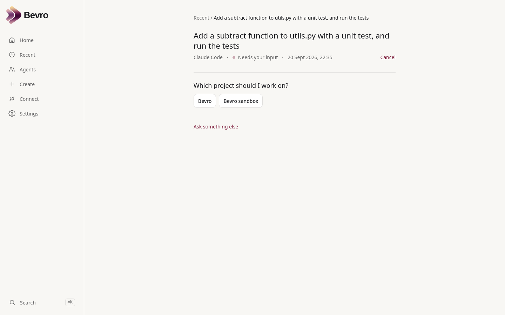

<p align="center">
  
  
</p>

# Bevro

**Agents that get things done.**

Bevro is a minimal workspace for getting work done through agents,
applications, workflows and other providers.

Ask once. Bevro routes the work, tracks what happens and keeps the result.

```
You:        "Allocate participants for the spring conference"
                     ↓
Bevro:      creates a Task, picks a provider, watches it work
                     ↓
Provider:   an agent, an app, a workflow, a coding tool, a person…
                     ↓
Result:     "Done. 148 participants allocated. 7 need review."   Review in Moimio →
```

**Bevro is not an agent framework.** It does not run agent loops, choose
models or hold prompts. It is the workspace and interoperability layer *above*
the things that do work: it remembers what was asked, hands it on, keeps a
faithful record of what came back, and stays out of the way.

**Bevro adapts to providers. Providers should not need to adapt to Bevro.**
Type the address of a service, the folder of an agent you already have, an
MCP server or a command; Bevro works out how to talk to it and what it can do.

> Status: early. The task model, the provider boundary, Connect (discovery of
> existing agents and services) and one real external provider (Claude Code)
> work end to end. Routing is a placeholder rule unless you turn on a routing
> model. Expect the shape to hold and the details to move.

## Screenshots

| Home | A result |
|---|---|
|  |  |

| Recent | Agents |
|---|---|
|  |  |

| A coding task asks which project… | …and reports what it changed |
|---|---|
|  |  |

<p align="center"></p>

## Key concepts

| | |
|---|---|
| **Provider** | Anything capable of doing work: an AI agent, a SaaS app, a workflow, a local service, a coding tool, a person. There is no provider *type*; a provider declares **capabilities** and how to reach it. |
| **Task** | Bevro's own record of a request: what was asked, where it has got to, the concise outcome. Tasks belong to Bevro, never to a provider. |
| **ProviderRun** | One provider doing work for one task. A task can have several. |
| **Artifact** | Any result: text, a report, a file, structured data, a diff, a deep link into another app, or something Bevro has never seen (shown as "Open result ↗"). |
| **Runtime** | How *this installation* of a provider runs or is reached — an API that is already up, a command in a folder, an MCP server, a Compose service, a systemd unit. Discovered, ranked, and kept on the provider; the router never sees it. [docs/RUNTIMES.md](docs/RUNTIMES.md). |
| **Adapter** | Bevro's implementation of one runtime mechanism: `local`, `http`, `mcp`, `command`, `claude_code`. One contract for all of them. |
| **Connect** | Discovery of something that already exists (a URL, a local project, an MCP server, a command) into a *ProviderDraft* the person confirms. Read-only towards the target; the adapter profile lives on Bevro's side. |
| **Create** | One sentence → an *AgentSpec* you agree to → a coding agent builds a real project → the same discovery → a Provider. [docs/CREATE.md](docs/CREATE.md). |
| **Workspace** | A directory a coding provider is allowed to work in. Configured on the server, never chosen by a prompt. |
| **Notification** | Something worth telling you about, separate from the work that produced it. In Bevro always; by email or webhook when set up. [docs/NOTIFICATIONS.md](docs/NOTIFICATIONS.md). |
| **Automation** | Work Bevro repeats: "every Monday morning", and — for monitoring — "only tell me when something changes". Agents do work; Bevro owns when. [docs/AUTOMATIONS.md](docs/AUTOMATIONS.md). |
| **Worker** | An optional host process for long-running providers that need local tools (currently Claude Code). |
| **Scheduler** | A small process that knows what time it is: it turns due automations into ordinary tasks. |

## Quick start

You need Docker with Compose v2. Nothing else.

```sh
git clone <repository-url> bevro
cd bevro
docker compose up -d --build
```

Open <http://localhost:6140>, type something in the box, press Enter.

That gives you the web app, the API (Swagger at <http://localhost:6141/docs>),
PostgreSQL, and two example providers: **Research** (returns an example
findings note) and **Moimio** (a demo of an app-backed provider that answers
with a summary and a deep link). Try
*"Allocate participants for the spring conference"* and
*"Compare three note-taking apps"*.

No configuration is needed. To change ports or set your own encryption key,
copy `.env.example` to `.env`. Everything else is in
[docs/DEVELOPMENT.md](docs/DEVELOPMENT.md).

## Architecture

```
User
 ↓
Bevro API → Router ── Deterministic rules (default, offline)
                   └─ Routing model (optional: OpenAI-compatible or Anthropic)
 ↓
Validated RoutingDecision
 ↓
Task → ProviderRun → Adapter → Provider → Artifact
```

- **Task belongs to Bevro. Providers perform work for Tasks.** A task moves
  through explicit states (`created`, `queued`, `working`, `needs_input`,
  `needs_approval`, `completed`, `failed`, `cancelled`, …) governed by one
  transition table.
- **Routing is separate from execution.** A router only proposes a provider;
  Bevro validates the proposal against its registry (exists, enabled,
  available, invocable) before any work starts. The default router is a set
  of local rules that calls nothing. Turn on a routing model and it chooses
  by declared capabilities, asks one question when something is missing, and
  falls back to the rules if it is slow, unreachable or wrong.
- Quick providers run inside the API. Long-running ones are taken from
  PostgreSQL by a plain worker process. No queue system, no Redis, no Celery.
- Nothing provider-specific is on `Task`. Claude Code is one adapter, not
  privileged architecture; Codex or another coding agent can implement the
  same contract.

Read more: [docs/ARCHITECTURE.md](docs/ARCHITECTURE.md) and [docs/ROUTING.md](docs/ROUTING.md).

## Intelligent routing (optional)

By default Bevro matches requests to agents with local rules and sends
nothing anywhere. To let a small model decide instead:

```sh
# .env
BEVRO_ROUTER_MODE=llm
BEVRO_ROUTER_BACKEND=openai        # or anthropic; any OpenAI-compatible server via BEVRO_ROUTER_BASE_URL
BEVRO_ROUTER_API_KEY=...
```

The model receives the request and a sanitised list of your agents (names,
descriptions, capabilities, availability) — never secrets, paths or
endpoints — and returns a structured choice that Bevro validates. It is
never used for the work itself. Privacy, schema, validation and fallback are
described in [docs/ROUTING.md](docs/ROUTING.md).

## Providers

Shipped:

| Provider | What it shows |
|---|---|
| Research | The plumbing: a request in, a note artifact out. Not a real search yet. |
| Moimio (demo) | An app-backed provider: specialist external UI, task execution, a one-line outcome, and a deep-link handoff ("Review in Moimio →"). Sample data; Bevro does not depend on it. |
| Claude Code | A real coding agent working in an approved directory on your machine. Optional; see below. |

## Connect an existing agent

Under **Connect**, type one thing:

```
~/agents/moimio-research          a local project
http://localhost:8000             a service with an OpenAPI description
http://localhost:3333/mcp         an MCP server
python -m my_agent                a command
```

Bevro looks (never touches), shows what it found — name, description,
capabilities, how it will be reached — asks for a key only if one is needed,
and connects. The agent appears under **Agents** and is routable at once.
Local projects and commands are inspected and run by the host worker inside
folders you approve (`BEVRO_LOCAL_ROOTS=~/agents` in `.env`); the project
itself is left byte-for-byte as it was. **Advanced setup** is the escape
hatch for anything discovery cannot work out. Read
[docs/CONNECT.md](docs/CONNECT.md).

If a project has useful code but no way in at all, Connect offers **Make it
connectable**: a coding agent you have connected writes a small bridge that
belongs to Bevro (under `data/integrations/`), Bevro checks it works and proves
your project is untouched, and it becomes an ordinary agent. Native interfaces
always win over a built one. See [docs/BRIDGES.md](docs/BRIDGES.md).

To have Bevro **build** an agent instead, use **Create**: describe the work in
a sentence, agree to a short preview, and a coding agent you have connected
writes a real, self-contained project that Bevro then discovers, validates and
activates like any other. See [docs/CREATE.md](docs/CREATE.md). To add a built-in one, read
[docs/BUILDING_A_PROVIDER.md](docs/BUILDING_A_PROVIDER.md) — it is a JSON
manifest and one Python function.

## Claude Code integration

Ask *"Fix the spacing on the Recent page and run the tests"* and Bevro asks
*Which project should I work on?*, runs Claude Code in that directory, shows
calm progress ("Inspecting the project · Making changes · Running checks"),
and keeps a plain-English summary, the list of changed files and a diff —
without exposing terminal output.

It is **optional** and off until you enable it: install and sign in to the
`claude` CLI, list the directories it may use in `config/workspaces.json`,
and run `./scripts/worker.sh`. Until then it shows as "Not available on this
installation". Permissions (`read`, `write`, `run_commands`) are per
workspace and shown in plain words; `git push`, `sudo` and similar are
blocked. What that does and does not guarantee is spelled out in
[docs/CODING_PROVIDER.md](docs/CODING_PROVIDER.md) and [SECURITY.md](SECURITY.md).

## Development

```sh
docker compose exec api sh -c 'cd /srv/api && pytest -q'                        # backend tests
docker compose exec web sh -c 'npx tsc --noEmit && npx vitest run && npm run build'   # frontend
```

Backend: Python 3.12, FastAPI, SQLAlchemy 2, Alembic, PostgreSQL.
Frontend: React, TypeScript, Vite, Tailwind on the supplied Bevro design tokens.
See [docs/DEVELOPMENT.md](docs/DEVELOPMENT.md) and [CONTRIBUTING.md](CONTRIBUTING.md).

## Scheduling and monitoring

Anything Bevro can do once, it can do again on a timetable — without changing
the agent that does it. Finish a task and choose **Schedule**, or say it on
Home ("every Friday, research new competitors") and confirm. Monitoring is the
same thing with a condition: *"check this daily and tell me only when
something changes"* stays quiet until it matters. Schedules are
timezone-aware, survive restarts, and run the work once — not once per missed
interval — when Bevro comes back. [docs/AUTOMATIONS.md](docs/AUTOMATIONS.md).

## Being told

Tasks record the work; **notifications** tell you when a result matters. A
monitoring run that finds something raises one notification: unread in Bevro,
with a **Needs your attention** line on Home and a link to the result. Set up
a mail server and it can reach you by email as well; give it a web address and
it posts a small, stable payload there. Nothing is required — with no mail
server at all, Bevro still tells you inside Bevro.

Delivery never touches the work: a task that succeeded stays succeeded even if
the email bounces, and Bevro retries the message rather than re-running the
agent. Summaries are scrubbed of paths and anything key-shaped before they
leave. [docs/NOTIFICATIONS.md](docs/NOTIFICATIONS.md).

## Roadmap

- Chat destinations (Slack, Teams, Telegram) on the existing delivery contract
- Browser push, so a notification arrives without Bevro being open
- Multi-provider plans (the decision schema already allows them; execution runs one provider per task today)
- Richer routing context for follow-ups on an existing task
- Replies to `needs_input` / `needs_approval` beyond choosing a project
- MCP over the older SSE transport (Streamable HTTP and stdio work)
- Bridges that call more than one entry point, or take structured arguments
- A second coding provider on the same contract
- Provider-declared UI for interactive results

## Contributing

Issues and pull requests are welcome. [CONTRIBUTING.md](CONTRIBUTING.md) has
the setup, the conventions and what a good PR looks like.
Security concerns: [SECURITY.md](SECURITY.md).

## Brand

The Bevro name, logo and design tokens in `brand/` and `web/public/brand/`
are the supplied brand package and are used as-is. See
[brand/bevro-brand/README.md](brand/bevro-brand/README.md). Trademark and
logo rights are separate from the software licence.

## Licence

Not yet chosen. Until a `LICENSE` file is added, all rights are reserved.
